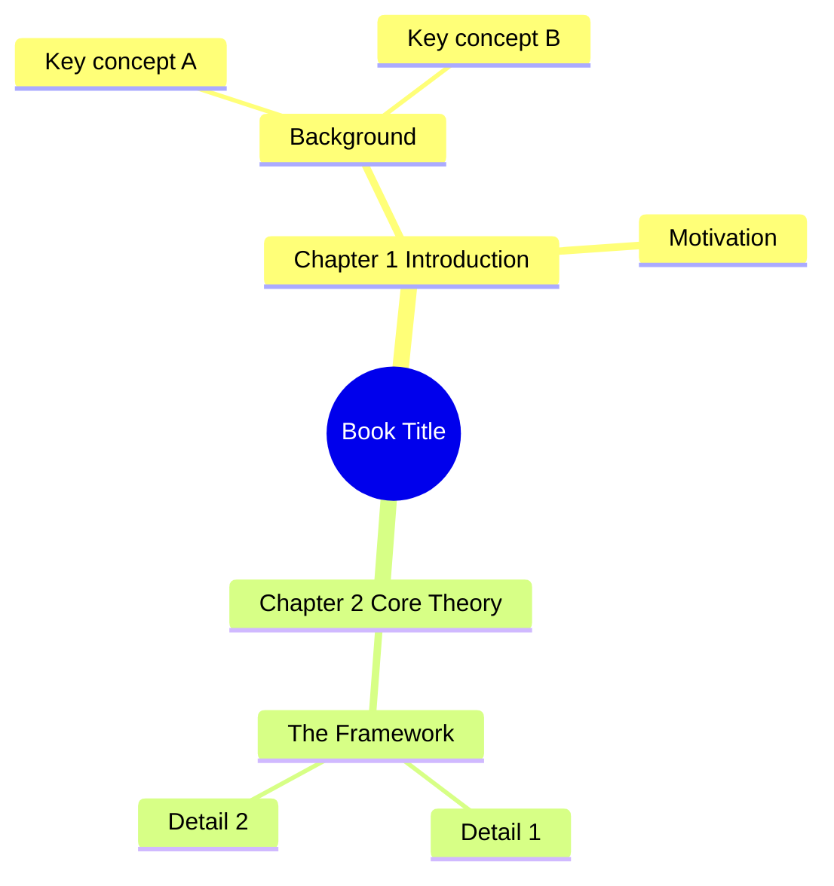

# Mind Map Export Format Comparison for 书海LM (shootHighLM)

> Deep comparison of file formats for exporting LLM-extracted mind maps from books/PDFs.
> Last updated: 2026-06-07

---

## 1. Markdown (as Mind Map Format)

### How It Works
Markdown headings (`#`, `##`, `###`…) or nested bullet lists (`-`, indented) represent the mind map hierarchy. Most mind map tools interpret heading levels or list nesting as parent-child relationships.

### Structure Example
```markdown
# Book Title
## Chapter 1: Introduction
### 1.1 Background
- Key concept A
- Key concept B
### 1.2 Motivation
- Why this matters
## Chapter 2: Core Theory
### 2.1 The Framework
- Detail 1
- Detail 2
```

Or with bullet nesting:
```markdown
- Book Title
  - Chapter 1: Introduction
    - 1.1 Background
      - Key concept A
      - Key concept B
    - 1.2 Motivation
  - Chapter 2: Core Theory
```

### What It CAN Represent
| Feature | Support |
|---------|---------|
| Node text (titles) | ✅ Full |
| Hierarchy / nesting | ✅ Full (via heading levels or indent) |
| Chinese text | ✅ Full (UTF-8 native) |
| Links (URLs) | ✅ `[text](url)` markdown links |
| Notes / descriptions | ✅ Paragraph text under a heading |
| Code blocks | ✅ Triple backtick |
| Bold / italic | ✅ Standard markdown |
| Images | ✅ `` syntax |
| Horizontal rules | ✅ `---` |

### What It CANNOT Represent
| Feature | Support |
|---------|---------|
| Node colors | ❌ No native support |
| Icons / emoji markers | ⚠️ Emoji yes, icon libraries no |
| Node shapes | ❌ |
| Boundary / grouping | ❌ |
| Relationships (cross-links) | ❌ (only inline links, not visual connections) |
| Floating topics | ❌ |
| Attachments (files) | ❌ (only links) |
| Priority markers | ❌ |
| Custom node metadata | ❌ |

### Import Support by App
| App | Imports Markdown? | Notes |
|-----|-------------------|-------|
| **XMind** | ✅ Yes | Imports `.md` via File → Import; heading levels become topics |
| **MindManager** | ⚠️ Limited | No direct MD import; needs OPML intermediary |
| **MindNode** | ✅ Yes | Imports `.md` natively; heading levels → nodes |
| **FreeMind/Freeplane** | ❌ No | Only OPML/MM import |
| **MindMaster** | ⚠️ Limited | May need conversion |
| **SimpleMind** | ✅ Yes | Imports `.md` files |
| **iThoughts** | ✅ Yes | Good MD import support |
| **Obsidian** | ✅ Native | It IS a markdown tool; Markmap plugin renders mind maps |

### Export Support by App
| App | Exports Markdown? |
|-----|-------------------|
| **XMind** | ✅ Yes |
| **MindNode** | ✅ Yes |
| **SimpleMind** | ✅ Yes |
| **iThoughts** | ✅ Yes |
| **Obsidian** | ✅ Native |

### Generation Complexity
- **Python**: Trivial. Just string formatting. No libraries needed.
- **Effort**: ⭐ (1/5)

### Chinese Text Support
✅ Excellent — UTF-8 is native to Markdown.

---

## 2. OPML (Outline Processor Markup Language)

### Full Spec Details
OPML is an XML format for outlines. Version 1.0 and 2.0 exist. Each `<outline>` element is a node with arbitrary `attribute="value"` pairs.

### Structure Example
```xml
<?xml version="1.0" encoding="UTF-8"?>
<opml version="2.0">
  <head>
    <title>Book Mind Map</title>
    <dateCreated>Mon, 07 Jun 2026 00:00:00 +0800</dateCreated>
  </head>
  <body>
    <outline text="Book Title">
      <outline text="Chapter 1: Introduction">
        <outline text="1.1 Background">
          <outline text="Key concept A"/>
          <outline text="Key concept B"/>
        </outline>
        <outline text="1.2 Motivation"/>
      </outline>
      <outline text="Chapter 2: Core Theory">
        <outline text="2.1 The Framework"/>
      </outline>
    </outline>
  </body>
</opml>
```

### What It CAN Represent
| Feature | Support |
|---------|---------|
| Node text | ✅ `text` attribute |
| Hierarchy | ✅ Nested `<outline>` elements |
| Chinese text | ✅ UTF-8 in XML |
| Links | ✅ `htmlUrl` or custom attributes |
| Custom attributes | ✅ Arbitrary `key="value"` on `<outline>` |
| Notes | ⚠️ `text` can contain HTML; `_note` attribute in some apps |
| Metadata (head) | ✅ title, dateCreated, ownerName, etc. |
| Expansion state | ✅ `expansionState` in `<head>` |

### What It CANNOT Represent
| Feature | Support |
|---------|---------|
| Node colors | ❌ Not in spec (some apps add custom attributes) |
| Icons | ❌ Not in spec |
| Node shapes | ❌ |
| Cross-link relationships | ❌ |
| Floating topics | ❌ |
| Images embedded | ❌ |
| Attachments | ❌ |
| Rich formatting | ⚠️ HTML in text is app-specific |

### Import Support by App
| App | Imports OPML? | Notes |
|-----|----------------|-------|
| **XMind** | ✅ Yes | File → Import OPML |
| **MindManager** | ✅ Yes | Native OPML import |
| **MindNode** | ✅ Yes | Excellent OPML import |
| **FreeMind/Freeplane** | ✅ Yes | Full support |
| **MindMaster** | ✅ Yes | Supports OPML import |
| **SimpleMind** | ✅ Yes | OPML import |
| **iThoughts** | ✅ Yes | First-class OPML support |
| **Obsidian** | ❌ No | Not a mind map tool per se |

### Export Support by App
| App | Exports OPML? |
|-----|----------------|
| **XMind** | ⚠️ Indirect (export to FreeMind MM, then convert) |
| **MindManager** | ✅ Yes |
| **MindNode** | ✅ Yes |
| **FreeMind/Freeplane** | ✅ Yes |
| **iThoughts** | ✅ Yes |

### Generation Complexity
- **Python**: Easy. Use `xml.etree.ElementTree` or string templates.
- **Effort**: ⭐⭐ (2/5)

### Chinese Text Support
✅ Excellent — XML supports UTF-8 natively.

---

## 3. Mermaid

### As an Export Format
Mermaid is a text-based diagram language. Mind maps were added in Mermaid v9.3+ (2022).

### Structure Example


### What It CAN Represent
| Feature | Support |
|---------|---------|
| Node text | ✅ |
| Hierarchy | ✅ Indentation-based |
| Chinese text | ✅ UTF-8 |
| Shapes | ✅ `((rounded))`, `[square]`, `))asymmetric((` |

### What It CANNOT Represent
| Feature | Support |
|---------|---------|
| Node colors | ⚠️ Limited (class-based styling) |
| Icons | ❌ |
| Links/notes | ❌ |
| Images | ❌ |
| Attachments | ❌ |
| Cross-links | ❌ |
| Custom metadata | ❌ |

### Import Support by App
| App | Imports Mermaid? |
|-----|-------------------|
| **XMind** | ❌ No |
| **MindManager** | ❌ No |
| **MindNode** | ❌ No |
| **FreeMind** | ❌ No |
| **MindMaster** | ❌ No |
| **SimpleMind** | ❌ No |
| **iThoughts** | ❌ No |
| **Obsidian** | ✅ Renders via plugin (display only) |

**Key limitation**: Mermaid mind maps are primarily for **rendering in documentation** (GitHub, Obsidian, docs sites), NOT for import into mind mapping apps. No major mind map tool imports Mermaid directly.

### Generation Complexity
- **Python**: Easy. String formatting with indentation.
- **Effort**: ⭐⭐ (2/5)

### Chinese Text Support
✅ Good, but some older renderers may have font issues.

---

## 4. XMind (.xmind)

### Format Structure
An `.xmind` file is actually a **ZIP archive** containing:
- `content.json` — The main mind map data (JSON)
- `metadata.json` — Workbook metadata
- `manifest.json` — File manifest
- `Thumbnails/` — Preview thumbnail
- `attachments/` — Embedded images/files (optional)

### content.json Structure (Simplified)
```json
[
  {
    "id": "root-topic-id",
    "class": "sheet",
    "title": "Sheet 1",
    "rootTopic": {
      "id": "topic1",
      "title": "Book Title",
      "children": {
        "attached": [
          {
            "id": "topic2",
            "title": "Chapter 1: Introduction",
            "children": {
              "attached": [
                {
                  "id": "topic3",
                  "title": "1.1 Background"
                }
              ]
            }
          }
        ]
      },
      "structureClass": "org.xmind.ui.logic.right"
    }
  }
]
```

### What It CAN Represent
| Feature | Support |
|---------|---------|
| Node text | ✅ `title` field |
| Rich text (HTML) | ✅ `title` with `<p>`, `<b>`, etc. |
| Hierarchy | ✅ Nested `children.attached` / `children.detached` |
| Notes | ✅ `notes.plain` and `notes.html` |
| Links | ✅ `href` field |
| Labels | ✅ `labels` array |
| Images | ✅ `image.src` (reference to attachment) |
| Icons/markers | ✅ `markerRefs` with icon IDs |
| Colors | ✅ Theme/style classes |
| Boundaries | ✅ `boundary` objects |
| Relationships | ✅ `relationship` objects with `end1Id`, `end2Id` |
| Floating topics | ✅ `children.detached` |
| Multiple sheets | ✅ Array of sheets |
| Chinese text | ✅ Full UTF-8 JSON |

### What It CANNOT Represent
| Feature | Support |
|---------|---------|
| (Very complete format) | Almost everything is supported |

### Is It Documented?
- **Officially**: No complete public spec. XMind Ltd has not published a formal format specification.
- **Practically**: Yes — the format has been reverse-engineered. The Python `xmind-sdk-python` library (MIT, by XMind Ltd) creates valid files. Community libraries exist for reading/writing.
- **XMind 8** used XML-based format; **XMind 2020+** uses JSON-based format described above.

### Can We Generate It Programmatically?
✅ Yes, several options:
- `xmind-sdk-python` (official, but outdated — targets XMind 8 XML format)
- `xmindparser` (read-only)
- **Custom**: Generate JSON, zip it — straightforward
- `xmind` Python package on PyPI

### Generation Complexity
- **Python**: Moderate. Need to construct JSON structure and zip it. ~150-200 lines for basic generation.
- **Effort**: ⭐⭐⭐ (3/5)

### Import Support by App
| App | Imports .xmind? |
|-----|------------------|
| **XMind** | ✅ Native |
| **MindManager** | ⚠️ Limited (newer versions) |
| **MindNode** | ❌ No (used to, may still via OPML route) |
| **FreeMind/Freeplane** | ❌ No direct |
| **MindMaster** | ⚠️ Limited |
| **SimpleMind** | ❌ No |
| **iThoughts** | ✅ Yes |

### Chinese Text Support
✅ Excellent — JSON with UTF-8 encoding.

---

## 5. FreeMind (.mm)

### XML Format Details
FreeMind `.mm` is an XML format. Last updated with FreeMind 1.0.1 (2014). The format is well-documented and widely supported as a legacy interchange format.

### Structure Example
```xml
<?xml version="1.0" encoding="UTF-8"?>
<map version="1.0.1">
  <node TEXT="Book Title" FOLDED="false">
    <node TEXT="Chapter 1: Introduction" POSITION="right">
      <node TEXT="1.1 Background">
        <node TEXT="Key concept A"/>
        <node TEXT="Key concept B"/>
      </node>
      <node TEXT="1.2 Motivation">
        <richcontent TYPE="NOTE">
          <html>...</html>
        </richcontent>
        <linktarget LOCATION="https://example.com"/>
      </node>
    </node>
    <node TEXT="Chapter 2: Core Theory" POSITION="left"/>
  </node>
</map>
```

### What It CAN Represent
| Feature | Support |
|---------|---------|
| Node text | ✅ `TEXT` attribute |
| Rich text (HTML) | ✅ `<richcontent>` element |
| Hierarchy | ✅ Nested `<node>` elements |
| Notes | ✅ `<richcontent TYPE="NOTE">` |
| Links | ✅ `LINK` attribute |
| Icons | ✅ `<icon BUILTIN="bookmark"/>` (built-in set) |
| Colors | ✅ `COLOR`, `BACKGROUND_COLOR` attributes |
| Edges | ✅ `<edge COLOR="..." WIDTH="..."/>` |
| Fonts | ✅ `<font NAME="..." SIZE="..." BOLD="..."/>` |
| Folding state | ✅ `FOLDED="true"` |
| Position (left/right) | ✅ `POSITION="left"/"right"` |
| Chinese text | ✅ UTF-8 XML |

### What It CANNOT Represent
| Feature | Support |
|---------|---------|
| Relationships (cross-links) | ⚠️ `<arrowlink>` exists but limited |
| Images | ⚠️ Via `<richcontent TYPE="NODE">` with embedded HTML `` |
| Attachments | ❌ No native attachment support |
| Floating topics | ❌ |
| Modern styling | ❌ Limited visual options |

### Still Relevant?
**Moderately.** FreeMind itself is abandoned (2014), but its format is the **de facto interchange standard** for mind maps. Freeplane (the active fork) still uses `.mm`. Many apps import FreeMind format because it's the most widely supported mind map interchange format.

### Import Support by App
| App | Imports .mm? |
|-----|---------------|
| **XMind** | ✅ Yes |
| **MindManager** | ⚠️ May need conversion |
| **MindNode** | ⚠️ Indirect |
| **FreeMind/Freeplane** | ✅ Native |
| **MindMaster** | ✅ Yes |
| **SimpleMind** | ✅ Yes |
| **iThoughts** | ✅ Yes (first-class) |

### Generation Complexity
- **Python**: Easy. Use `xml.etree.ElementTree` or lxml.
- **Effort**: ⭐⭐ (2/5)

### Chinese Text Support
✅ Excellent.

---

## 6. MindManager (.mmap)

### Format Details
MindManager `.mmap` files are **ZIP archives** containing XML files. The primary XML uses a proprietary schema.

### Structure (Simplified)
```
.mmap (ZIP)
├── Document.xml          — Main mind map content
├── Document_Styles.xml   — Style definitions
├── Data.xml              — Additional data
├── [Attachments]/         — Embedded files
└── META-INF/             — Manifest
```

The main `Document.xml` uses a complex XML schema with `<ap:Topic>`, `<ap:SubTopic>`, etc., with extensive styling attributes.

### What It CAN Represent
| Feature | Support |
|---------|---------|
| Node text | ✅ |
| Rich text | ✅ |
| Hierarchy | ✅ |
| Notes | ✅ |
| Links | ✅ |
| Icons/markers | ✅ Extensive built-in library |
| Colors | ✅ Full styling |
| Images | ✅ Embedded |
| Attachments | ✅ Embedded files |
| Relationships | ✅ |
| Boundaries | ✅ |
| Tags/labels | ✅ |
| Chinese text | ✅ |

### Is It Open? Can We Write It?
**No and partially.**
- The format is **proprietary** and **not fully documented**. There's no official public spec.
- Some reverse engineering exists. The XML schema is verbose and complex.
- Writing a valid `.mmap` is **very difficult** without official tooling.
- MindManager does provide an SDK/API, but it's Windows-only COM-based.

### Import Support by App
| App | Imports .mmap? |
|-----|-----------------|
| **XMind** | ⚠️ Limited |
| **MindManager** | ✅ Native |
| **MindNode** | ✅ Yes (import support) |
| **FreeMind** | ⚠️ Indirect |
| **iThoughts** | ✅ Yes |

### Generation Complexity
- **Python**: Very hard. Proprietary binary+XML ZIP with undocumented schema.
- **Effort**: ⭐⭐⭐⭐⭐ (5/5) — Not recommended for generation.

### Recommendation for 书海LM
❌ **Do not target .mmap as an export format.** It's too complex and undocumented. Let MindManager users import via OPML or FreeMind format instead.

---

## 7. Markmap

### How It Works
Markmap is a **rendering library**, not a file format. It takes standard Markdown (with heading hierarchy) and renders it as an interactive mind map in the browser.

```markdown
# Book Title
## Chapter 1
### Section 1.1
### Section 1.2
## Chapter 2
```

↓ Markmap renders this as an interactive SVG mind map.

### Is It an Export Format?
**No.** Markmap is a **visualization tool**. It doesn't define a new format — it reads Markdown and renders it.

### What It Provides
- Interactive SVG mind map from Markdown
- Collapsible/expandable nodes
- Links work (clickable)
- Code highlighting
- Themes (colors per branch)
- Can export to SVG/HTML for sharing

### Integration for 书海LM
Markmap is an excellent **rendering option** for the Markdown output. You could:
1. Export `.md` as primary format
2. Bundle an HTML file with Markmap JS for instant visualization
3. Users get both: editable Markdown + beautiful mind map view

### NPM/CLI
- `markmap-cli` — generates standalone HTML files from `.md`
- `markmap-common` — programmatic rendering
- Obsidian plugin — renders mind maps inline

### Generation Complexity
- **Python**: N/A (it's JS-based rendering). But generating the Markdown input is ⭐ (1/5).
- **Effort**: ⭐ for input; ⭐⭐⭐ for bundling HTML renderer.

---

## 8. JSON-Based Formats

### Is There a Standard JSON Mind Map Format?
**No.** There is no widely-adopted standard JSON mind map interchange format. Each app has its own:

| Format | Origin | Notes |
|--------|--------|-------|
| XMind JSON | XMind 2020+ | Inside `.xmind` ZIP; not a standalone spec |
| MindMeister JSON | MindMeister | Proprietary API format |
| MindNode JSON | MindNode | Internal format |
| Coggle JSON | Coggle | API format |
| braindump JSON | Community | Niche, not widely adopted |

### XMind JSON (Most Viable)
As described in Section 4, XMind's `content.json` is the most programmable JSON format. But it's still app-specific, not a standard.

### MindMap JSON (Community Proposal)
Some community attempts exist but none have traction. There's no "JSON equivalent of OPML" for mind maps.

### Recommendation
For 书海LM, a **custom JSON schema** could serve as the internal representation (easy to generate from LLM, easy to transform to other formats). But don't expect other apps to import it directly.

### Generation Complexity
- **Python**: Trivial — `json.dumps()` with your schema.
- **Effort**: ⭐ (1/5)

---

## Summary Comparison Table

| Format | Hierarchy | Rich Text | Colors | Icons | Links | Notes | Images | Chinese | Gen. Complexity | Import Width* |
|--------|-----------|-----------|--------|-------|-------|-------|--------|---------|-----------------|---------------|
| **Markdown** | ✅ | ✅ (MD) | ❌ | ⚠️ emoji | ✅ | ✅ | ✅ | ✅ | ⭐ | 5/8 |
| **OPML** | ✅ | ⚠️ HTML | ❌ | ❌ | ✅ | ⚠️ | ❌ | ✅ | ⭐⭐ | 7/8 |
| **Mermaid** | ✅ | ❌ | ⚠️ | ❌ | ❌ | ❌ | ❌ | ✅ | ⭐⭐ | 0/8 |
| **XMind** | ✅ | ✅ | ✅ | ✅ | ✅ | ✅ | ✅ | ✅ | ⭐⭐⭐ | 3/8 |
| **FreeMind** | ✅ | ✅ | ✅ | ✅ | ✅ | ✅ | ⚠️ | ✅ | ⭐⭐ | 6/8 |
| **MindManager** | ✅ | ✅ | ✅ | ✅ | ✅ | ✅ | ✅ | ✅ | ⭐⭐⭐⭐⭐ | 2/8 |
| **Markmap** | ✅ (MD) | ✅ (MD) | ⚠️ | ⚠️ emoji | ✅ | ✅ | ✅ | ✅ | ⭐ | N/A (renderer) |
| **Custom JSON** | ✅ | ✅ | ✅ | ✅ | ✅ | ✅ | ✅ | ✅ | ⭐ | 0/8 |

*Import Width = number of the 8 major apps (XMind, MindManager, MindNode, FreeMind, MindMaster, SimpleMind, iThoughts, Obsidian) that can import the format.

---

## Why Choose Markdown as PRIMARY Export Format?

### Markdown vs OPML — The Tradeoffs

#### Advantages of Markdown over OPML

1. **Human-Readable & Editable**
   - Markdown is immediately readable by anyone. OPML is XML noise.
   - Users can open `.md` in any text editor, VS Code, Obsidian, etc. and understand the content instantly.
   - OPML requires parsing XML to even see the outline structure.

2. **Ubiquity**
   - Every developer tool, note app, and knowledge system understands Markdown.
   - Obsidian, Notion, Roam, Logseq, Joplin, Typora — all native Markdown.
   - OPML is niche; mostly known in RSS/mind map circles.

3. **Progressive Enhancement**
   - A Markdown mind map is still a useful **document** even without mind map software.
   - OPML is useless without a tool that parses outlines.
   - For book summaries, this is critical — the content has value as a standalone document.

4. **Version Control Friendly**
   - Git diffs on Markdown are readable. OPML diffs are noisy XML.
   - Users can track changes to their mind maps in Git.

5. **Ecosystem Integration**
   - Obsidian + Markmap plugin = instant mind map visualization.
   - GitHub renders Markdown natively. OPML is rendered as raw XML.
   - Pandoc can convert Markdown to anything.

6. **Simplicity of Generation**
   - One line per node. No XML boilerplate, no escaping.
   - LLMs naturally produce Markdown-like hierarchies.

#### Advantages of OPML over Markdown

1. **Wider Mind Map Tool Support**
   - 7/8 major apps import OPML vs 5/8 for Markdown.
   - FreeMind/Freeplane only import OPML (not Markdown).
   - OPML is the closest thing to a "universal mind map interchange format."

2. **Structured Attributes**
   - OPML can carry arbitrary metadata on `<outline>` elements.
   - You can add `_note`, `htmlUrl`, custom app-specific attributes.
   - Markdown has no equivalent for structured key-value pairs.

3. **Standardized Spec**
   - OPML has a formal specification (v1.0, v2.0).
   - Markdown as mind map has no formal spec — interpretation varies by app.

### The Recommended Strategy

**Primary: Markdown** — for human readability, editability, and ecosystem value.

**Secondary: OPML** — for maximum tool compatibility. Auto-generate alongside Markdown.

**Tertiary: FreeMind (.mm)** — for legacy mind map tool compatibility. Still widely imported.

**Tertiary: XMind (.xmind)** — for users who specifically use XMind.

**Rendering: Markmap** — bundle an HTML+Markmap file for instant visual preview.

```
书海LM output:
├── book-title/
│   ├── mindmap.md          ← PRIMARY (human-readable, editable)
│   ├── mindmap.opml        ← SECONDARY (tool-compatible)
│   ├── mindmap.mm          ← TERTIARY (legacy interchange)
│   ├── mindmap.html        ← RENDERED (Markmap interactive view)
│   └── mindmap.json        ← INTERNAL (structured data for programmatic use)
```

This gives users:
- **Markdown**: Read in any editor, Obsidian, GitHub, etc.
- **OPML**: Import into any mind map tool
- **FreeMind**: Import into Freeplane and many others
- **HTML**: Instant visual mind map in browser
- **JSON**: For programmatic processing or custom tooling

---

## Appendix: Quick-Reference Generation Recipes

### Markdown (Python)
```python
def to_markdown(nodes, level=1):
    lines = []
    for node in nodes:
        lines.append(f"{'#' * min(level, 6)} {node['text']}")
        if node.get('note'):
            lines.append(f"\n> {node['note']}\n")
        if node.get('children'):
            lines.append(to_markdown(node['children'], level + 1))
    return '\n'.join(lines)
```

### OPML (Python)
```python
import xml.etree.ElementTree as ET

def to_opml(nodes):
    opml = ET.Element('opml', version='2.0')
    head = ET.SubElement(opml, 'head')
    ET.SubElement(head, 'title').text = 'Book Mind Map'
    body = ET.SubElement(opml, 'body')
    for node in nodes:
        body.append(node_to_outline(node))
    return ET.tostring(opml, encoding='unicode', xml_declaration=True)

def node_to_outline(node):
    outline = ET.Element('outline', text=node['text'])
    if node.get('note'):
        outline.set('_note', node['note'])
    if node.get('link'):
        outline.set('htmlUrl', node['link'])
    for child in node.get('children', []):
        outline.append(node_to_outline(child))
    return outline
```

### FreeMind .mm (Python)
```python
def to_freemind(nodes):
    mm = ET.Element('map', version='1.0.1')
    root = ET.SubElement(mm, 'node', TEXT=nodes[0]['text'], FOLDED='false')
    for child in nodes[0].get('children', []):
        add_mm_node(root, child, 'right')
    return ET.tostring(mm, encoding='unicode', xml_declaration=True)

def add_mm_node(parent, node, position):
    el = ET.SubElement(parent, 'node', TEXT=node['text'], POSITION=position)
    if node.get('link'):
        el.set('LINK', node['link'])
    for i, child in enumerate(node.get('children', [])):
        pos = 'right' if i % 2 == 0 else 'left'  # alternate sides
        add_mm_node(el, child, pos)
```

### Markmap HTML (Python)
```python
MARKMAP_HTML = """<!DOCTYPE html>
<html><head>
  <script src="https://cdn.jsdelivr.net/npm/markmap-autoloader"></script>
</head><body>
  <style>.markmap {{ width: 100%; height: 100vh; }}</style>
  <div class="markmap">{markmap_content}</div>
</body></html>"""

def to_markmap_html(markdown_text):
    # Convert headings to markmap format
    return MARKMAP_HTML.format(markmap_content=markdown_text)
```